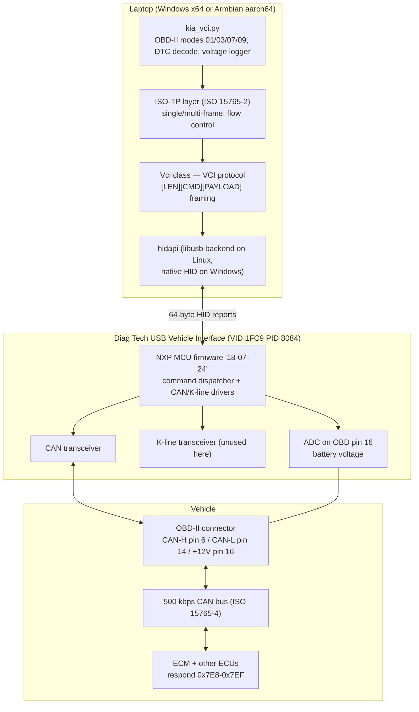
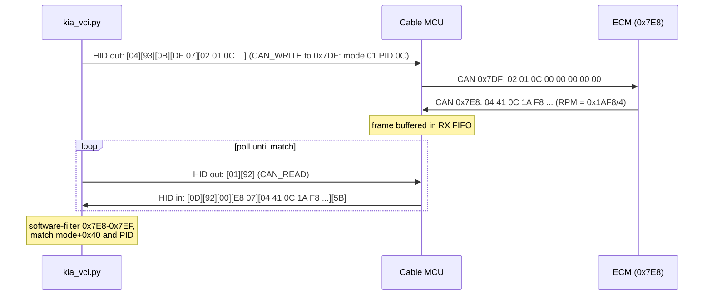

# System Architecture

## What this project is

A Bavarian Technic diagnostic cable — sold as a BMW-only tool — repurposed
as a **generic CAN / OBD-II interface** for any modern vehicle. The vendor
software is bypassed entirely: our Python code speaks directly to the
cable's microcontroller over USB HID, and through it to the car.

## The stack

Each layer is independently useful:

| Layer | File / component | Replaceable with |
|---|---|---|
| OBD-II application | `kia_vci.py` subcommands | any diagnostic logic |
| ISO-TP transport | `isotp_recv` / `obd_request` | UDS client, manufacturer protocols |
| VCI cable protocol | `Vci` class | — (this is the reverse-engineered part) |
| USB transport | hidapi | any HID library |

## Why the cable works on non-BMW cars

The cable's firmware exposes **raw CAN primitives** (`CAN_CONFIG`,
`CAN_WRITE`, `CAN_READ`) with a 500 kbps preset. BMW's D-CAN and the
legislated OBD-II physical layer (ISO 15765-4) are the *same electrical
thing*: 500 kbps, 11-bit identifiers, on OBD pins 6/14. The only
BMW-specific parts of the vendor product live in its Windows application
layer, which we do not use.

On top of raw CAN, every 2008+ US-market vehicle must implement the same
emissions diagnostics: requests broadcast to CAN ID `0x7DF`, responses
from `0x7E8–0x7EF`, payloads in ISO-TP. That is why one script covers a
2018 Kia Soul, a 2023 Nissan Rogue, and a 2023 Mazda CX-50 without
vehicle-specific code.

## An OBD-II query, end to end

Multi-frame responses (e.g. the 17-byte VIN) add ISO-TP flow control: the
ECM sends a First Frame, we must answer `30 00 00` to its physical ID
(response ID − 8) before it sends Consecutive Frames.

## Host environments

- **Windows**: no driver needed; the OS generic HID driver binds
  automatically. (The FTDI driver package shipped by the vendor is for
  older, FTDI-based cable generations — not this hardware.)
- **Linux (tested: Armbian aarch64, ThinkPad X13s)**: kernel `usbhid` +
  `hidraw` are the driver; `python3-hidapi` (libusb backend) does user-space
  access. One udev rule grants non-root access. See README for setup.
- `cable_reset.py` recovers a hung cable remotely via `USBDEVFS_RESET`
  (kernel USB port reset) — see the operational notes in
  [vci-protocol.md](vci-protocol.md#firmware-landmines).
