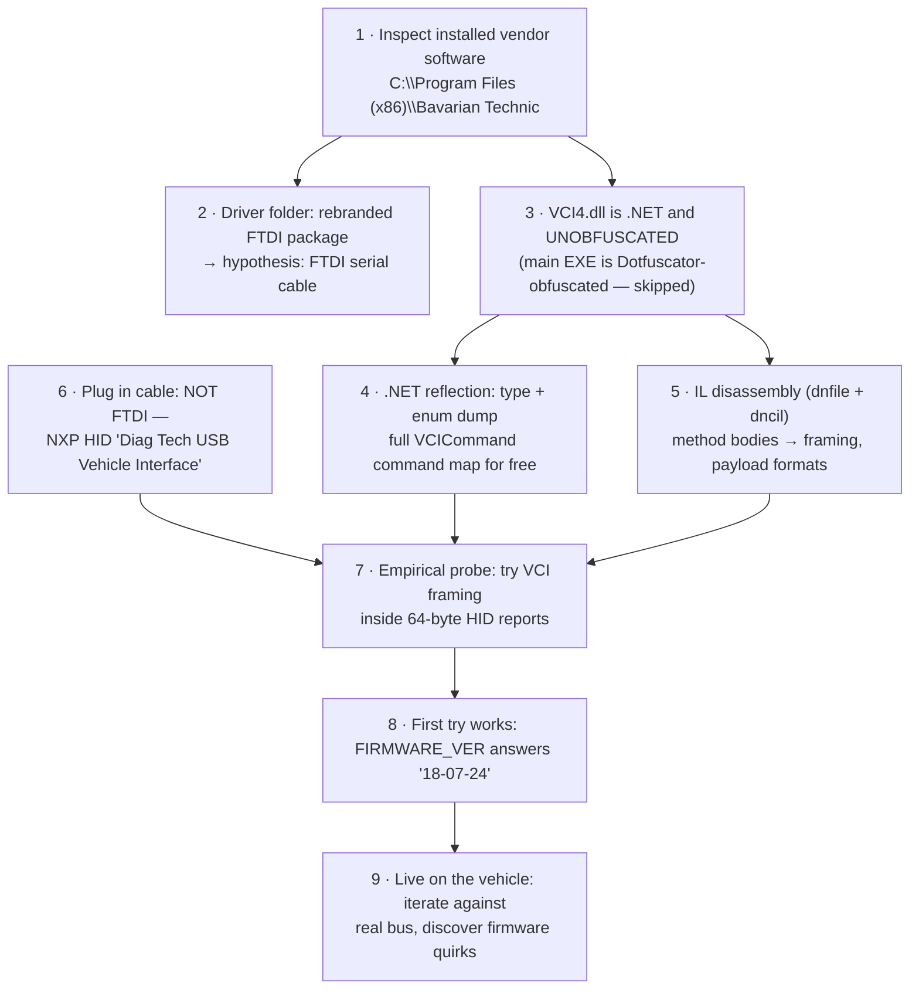

# How the Protocol Was Reverse-Engineered

A methodology write-up: how we went from "BMW-only cable, unknown
internals" to a working cross-vendor OBD-II tool in one evening, using
only the vendor's own installed software and the cable itself.
(Interoperability research on our own hardware for use with our own
vehicles.)

## The route



## Step by step

### 1–2. Reconnaissance of the vendor install

The install folder tells you most of what you need before touching a
disassembler:

- `Driver/` contained a stock FTDI CDM driver package with the INF
  rebranded (`"Durametric Diagnostic USB"`, VID `0403` PID `CE00`) —
  revealing the hardware family (shared with the Durametric Porsche tool)
  and that *older* cables are FTDI serial bridges.
- `ftd2xx*.dll/lib` shipped next to the EXE confirmed direct D2XX use.
- `01_18_00.aes` / `01_21_00.kes` (14 KB each) look like encrypted MCU
  firmware images → there's a real microcontroller in the cable, not just
  a dumb bridge.
- `VCI4.dll` — "VCI" = Vehicle Communication Interface. The interesting one.

### 3–4. The unobfuscated satellite DLL

`BavarianTechnic.exe` is Dotfuscator-obfuscated (`#=q...` type names) —
painful. But **`VCI4.dll` was shipped unobfuscated**, a common oversight
with helper assemblies. .NET reflection (PowerShell, no tools needed)
dumped every type, method signature, and — critically — the complete
`VCICommand` enum with numeric values: the cable's entire command
vocabulary, including a raw CAN group nobody advertises
(`CAN_CONFIG/READ/WRITE/...`).

```powershell
$asm = [Reflection.Assembly]::LoadFile("...\VCI4.dll")
[Enum]::GetNames($asm.GetType('Vci4.VCICommand'))
```

### 5. IL disassembly for the wire details

Signatures don't give you byte layouts; method bodies do. With no .NET SDK
on the machine, Python's `dnfile` + `dncil` served as the disassembler
(script pattern: parse the PE, map metadata tokens to names, decode each
method's CIL). Reading the IL of a few small methods yielded:

- `VciMessage..ctor(cmd, payload)` → the `[LEN][CMD][PAYLOAD]` framing
  and 256-byte cap.
- `Vci4.CANWrite` → CAN TX payload layout `[n+3][id lo][id hi][data]`.
- `Vci4.CANConfig(3)` inside `DiscoverModulesBMWUDS` → preset 3 = the
  500 kbps D-CAN rate (identical to OBD-II ISO 15765-4).
- `Vci4.OpenDevice` → serial transport at 921600 8N1 for the
  Cypress/CH340/STM32 cable generations, and their VID/PIDs.
- `ReportExternalPowerStatus` → the ADC voltage command and scaling.
- `KeepAlive` sending `0x3E` (UDS TesterPresent) → confirmation that the
  protocol layer carries raw diagnostic bytes.

### 6–8. The hardware plot twist, then first contact

The actual cable enumerated as **NXP HID `1FC9:8084`**, not FTDI and not
serial — a newer generation than any code path in `VCI4.dll`'s
`OpenDevice`. Hypothesis: same message framing, HID reports as transport
(the DLL even embeds a `HidLibrary`). The first empirical probe —
`[report id 0][01][02]` zero-padded to 64 bytes — answered immediately
with `0C 02 "18-07-24"`. Same protocol, different pipe.

Lesson: *disassembly gave the message grammar; five minutes of probing
settled the transport question that static analysis couldn't.*

### 9. Live iteration and the quirks

Everything in the [landmines section](vci-protocol.md#firmware-landmines)
was found the hard way against the live vehicle, by treating every anomaly
as data:

- Responses appearing in the *next* query's window → deep RX FIFO,
  polling slower than the bus → software filtering + fast polling.
- One identical frame repeating forever after `CAN_ADD_FILTER` → filter
  latch bug → never filter in hardware.
- Queries dying after stop/start cycles while the ADC read froze at a
  suspiciously constant value → TX wedge with a reliable tell.
- A soft-`RESET` "recovery" that made things worse (half-booted MCU) →
  USB port reset as the remote cure.

## Tooling summary

| Purpose | Tool |
|---|---|
| Type/enum dump of .NET assemblies | PowerShell reflection |
| CIL method-body disassembly | Python `dnfile` + `dncil` |
| USB device identification | Windows PnP / `lsusb` |
| HID transport | `hidapi` (Windows + Linux/aarch64) |
| Remote cable recovery | `USBDEVFS_RESET` ioctl (`cable_reset.py`) |

## What we did *not* need

No firmware dumping, no USB traffic sniffing of the vendor app (never even
ran it against a car), no debugging of the obfuscated EXE, and no hardware
teardown. One readable satellite DLL plus an hour of live probing was
enough — check the easy doors before picking locks.
