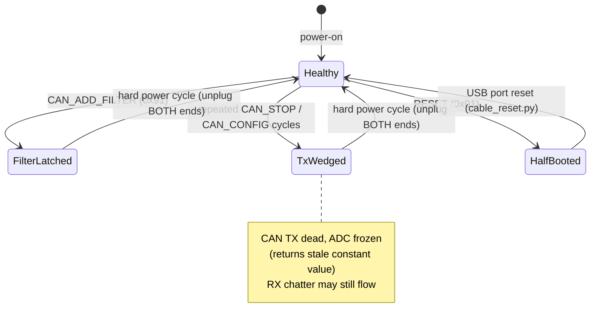

# VCI Cable Protocol Specification

Reverse-engineered from `VCI4.dll` (vendor .NET assembly) and verified
live against cable firmware `18-07-24`. See
[reverse-engineering.md](reverse-engineering.md) for how.

## Device identification

| Property | Value |
|---|---|
| USB VID:PID | `1FC9:8084` (NXP Semiconductors) |
| Product string | `Diag Tech USB Vehicle Interface` |
| Manufacturer string | `Diagnose Technic` |
| USB class | HID, vendor usage page `0xFF00` |
| Power | USB bus **and** OBD pin 16 (battery) — either keeps the MCU alive |

Older cable generations use different bridges (FTDI `0403:CE00`, Cypress
`04B4:0002`, CH340 `1A86:7523`, STM32 VCP `0483:5740`) and appear as
serial ports at 921600 8N1 carrying the same message framing.

## Transport framing

All traffic is 64-byte HID reports with report ID `0`. A message starts at
byte 0 of the report data:

```
offset 0:  LEN      = len(PAYLOAD) + 1
offset 1:  CMD      command byte
offset 2+: PAYLOAD  (LEN - 1 bytes)
```

Responses use identical framing and echo the command byte. A message
longer than one report continues in subsequent reports (total ≤ 256
bytes). Unused report bytes are zero-padded.

## Command reference

Values from the `Vci4.VCICommand` enum. Commands verified live are marked ✓.

| Cmd | Name | Payload → Response | Verified |
|---|---|---|---|
| 0x01 | RESET | — ; **do not use** (see landmines) | ✓ |
| 0x02 | FIRMWARE_VER | — → ASCII date, e.g. `18-07-24` | ✓ |
| 0x03 | SERIAL_NUM | — → 17-byte blob | ✓ |
| 0x0A | ADC | — → `[status][mV lo][mV hi]`, battery voltage on pin 16 | ✓ |
| 0x12 | GET_MODE | — → mode byte (02 = application) | ✓ |
| 0x40 | GET_PROD | — → product code (ours: `00 90`) | ✓ |
| 0x90 | CAN_CONFIG | `[preset]`; **3 = 500 kbps** (BMW D-CAN / ISO 15765-4) | ✓ |
| 0x91 | CAN_ADD_FILTER | uint32 LE CAN id; **broken — do not use** | ✓ |
| 0x92 | CAN_READ | — → one buffered RX frame (see below) | ✓ |
| 0x93 | CAN_WRITE | `[n+3][id lo][id hi][data ×8]` | ✓ |
| 0x94 | CAN_STOP | — ; avoid mid-session (see landmines) | ✓ |
| 0x95 | CAN_READ_ALL | — → 4-byte status (NOT a frame dump) | ✓ |
| 0x81 | CONFIG_PROTOCOL | protocol session setup (BMW/VW paths in vendor code) | |
| 0x82/0x83/0x84 | PROTOCOL_SEND_READ / SEND / READ | ECU message inside a configured session | |
| 0xB0 / 0xB1 | READ_KLINE_INIT / READ_KLINE | K-line access, unexplored | |
| 0x04–0x08, 0x14–0x24 | flash/EEPROM/bootloader/IAP group | firmware management — leave alone | |

Other enum values (0x0B TEST_KLINE, 0x10 SPECIAL_COMMAND, 0x11 HW_DELAY,
0x30–0x32 LOG_*, 0x41 GET_SIGNATURE, 0x77–0x7F TEST_*/DISCONNECT,
0xA0/0xA1, 0xFE NEXT_FRAME) are documented in the enum but unused here.

## CAN receive frame format

`CAN_READ` returns a 12-byte payload per frame:

```
[status][id_lo][id_hi][data0..data7][extra][0x5B]
   0       1      2       3..10       (11)  (last)
```

- 11-bit CAN ID = `(id_hi << 8) | id_lo`.
- Trailing byte is always `0x5B` (unidentified constant/counter).
- **Empty-FIFO marker**: with no bus traffic, reads return the garbage
  pattern `id=0x4BC4, data BC 4B 00 10 13 C7 2B 7F` repeatedly. Treat it
  as "no data", not as a real frame.

## Firmware landmines

Hard-won operational rules, all reproduced on firmware `18-07-24`:



1. **`CAN_ADD_FILTER` latches a stale frame** — after use, every read
   returns the same frame forever. Filter in software instead.
2. **Repeated `CAN_STOP`/`CAN_CONFIG` wedges CAN TX and freezes the ADC.**
   Symptom: queries get no responses and the voltage reading stops
   changing (a suspiciously constant reading is the tell). Configure CAN
   once per session and never stop it.
3. **`RESET` (0x01) leaves the MCU half-booted** — it answers HID but all
   payloads come back empty. `USBDEVFS_RESET` (see `cable_reset.py`)
   recovers this state remotely.
4. Pin 16 keeps the MCU powered even with USB unplugged, so wedge states
   survive USB replug. Full recovery requires unplugging **both** ends.
5. The RX FIFO buffers *all* bus traffic. A live vehicle bus produces
   hundreds of frames/s while HID polling drains tens/s, so responses sit
   behind a backlog. Poll fast, match responses by content, tolerate
   stale frames.

## Timing measured

| Operation | Rate/latency |
|---|---|
| HID command round-trip | ~2–15 ms |
| ADC polling (voltage logger) | ~64 Hz sustained |
| CAN_READ polling | ~30–70 frames/s (well below bus rate) |
